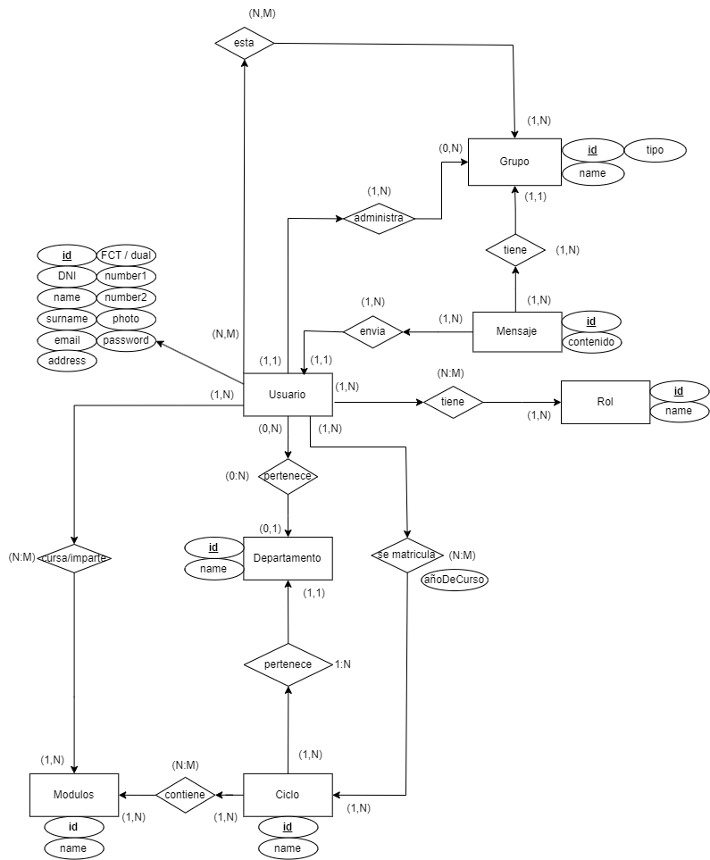

# Elorchat
# Descripción del proyecto.
El proyecto consiste en una aplicación de Android “Elorchat” y un servidor API-REST. A continuación explicaremos las diferentes funcionalidades de cada una.
# Autenticación y Registro
* Iniciar sesión mediante autenticación con login/password.
* Funcionalidad "Recordarme" para almacenar el último usuario logueado.
* Recuperación de contraseña mediante generación aleatoria de una nueva clave y envío de la misma por correo electrónico.
#  Funcionalidades de Chat para Alumnos
* Crear, borrar, unirse y abandonar grupos de chat libres.
* No permitir unirse o abandonar grupos de chat privados.
* Recibir notificaciones sobre mensajes y cambios en grupos.
* Enviar y recibir mensajes de grupos libres o privados.
# Funcionalidades Adicionales para Profesores
* Crear grupos privados.
* Asignar y desasignar alumnos a grupos privados.
# Mensajes
* Muestran texto, imágenes, archivos y posición GPS.
* Se actualiza instantáneamente.
# Adicionales
* La aplicación puede ser utilizada en Español, Euskera e Inglés (Multiidioma).
* Existe Modo Oscuro.

Los repositorios de los proyectos son los siguientes:
* Servidor : https://github.com/JoanaElorrieta/ElorchatServer
* App: https://github.com/Guslin-03/Reto-Final

# Built With (construido con)

Tecnologías que se han utilizado para crear toda la capa del servidor, que en principio serán:
* Spring Boot (3.0.2)
* Hibernate
* Socket.io

# Getting Started
# Prerrequisites (Prerrequisitos para arrancar el proyecto)
Para poder utilizar el proyecto, previamente se tiene que tener instalado docker y crear dos contenedores: uno de MYSQL y otro de Laravel.
Los comandos necesarios en Ubuntu serían los siguientes:
* sudo apt install docker-compose
* curl -s "https://laravel.build/eloradmin?with=mysql" | bash
* cd eloradmin && ./vendor/bin/sail up -d

A continuación, dentro del contenedor de Laravel, por ejemplo, utilizando la terminal de Visual Studio deberemos clonar el siguiente proyecto https://github.com/RobsonGarciaJunior/RetoFinal_Server.

# Installation (Instalación)
A continuación detallamos la importación del Server y de la App Móvil.
## Server
1. Instalación Git Bash
Para poder clonar el proyecto en nuestro ordenador deberemos instalar primeramente Git Bash sin ninguna configuración especial.
2. Clonado del proyecto
Accederemos a la carpeta en la que deseamos clonar el proyecto. En este caso, dado que se trata del Server lo clonaremos dentro de la carpeta “\eclipse-workspace” y abriremos la terminal de Git Bash.
	A continuación haremos uso del siguiente comando:
	https://github.com/JoanaElorrieta/ElorchatServer.git
3. Modificar src/main/resources/application.properties las siguientes propiedades:
Host del servidor del Socket: Se debe incluir la IP del ordenador desde donde se está arrancando el servidor.
Host del servidor de Laravel: Se debe incluir la IP del ordenador desde donde se está arrancando el proyecto de Laravel
## App Móvil
1. Clonado del proyecto
Accederemos a la carpeta en la que deseamos clonar el proyecto. En este caso, dado que se trata de la App lo clonaremos dentro de la carpeta “\AndroidStudioProjects” y abriremos la terminal de Git Bash.
	A continuación haremos uso del siguiente comando:
	https://github.com/Guslin-03/Reto-Final.git  
2. Deberemos modificar en MyApp la propiedad “API_SERVER” y deberemos poner la IP desde dónde se haya arrancado el servidor.
3. Deberemos modificar en la clase RetrofitClientLaravel la propiedad “API_URI”, donde se deberá poner la IP desde dónde se encuentre arrancado el proyecto de Laravel.

# Usage (uso)
Para arrancar el proyecto, deberemos ir al archivo src/main/java/com.reto.elorchat/ElorchatApplication.java y pulsar “Run”.
Un ejemplo de las peticiones que se pueden solicitar a nuestro servidor sería, por ejemplo obtener todos los grupos que se encuentran en la base de datos: GET http://localhost:8063/api/chat/findAll/0
Para la realización de las pruebas referentes a las peticiones al Servidor realizamos una exportación de las colecciones creadas con anterioridad en Postman en  “src/main/resources/Elorchat.postman_collection.json”.
# Contact (Contacto)
Joana Barber (joana.barbermo@elorrieta-errekamari.com)
David Comerón (david.comeronal@elorrieta-errekamari.com) 
Robson Garcia (robson.garciaju@elorrieta-errekamari.com) 

# License (Licencia)
Distributed under the MIT License.
